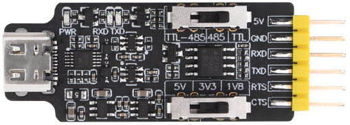

## 1 Introduction

### 1.1 Appearence
放外观图

### 1.2 Parameter
| Item                      | Describe            | 
|-------------------------- | ------------------- | 
| Interface Type            | Standard USB Type-C port, supporting dual plug     |
| Communication Interface   | Supports TTL and RS485 levels                      |
| Supply Voltage            | 5V(USB power supply)                               |
| Control Interface         | RTS (Output control), CTS (Input control)            |
| Output Voltage            | 1.8V/3.3V/5V    (Iout(max) =300mA)         |
| Compatibility             | Windows/Linux/MAC/Android                          |
| Baudrate                  | TTL:  50bps~2Mbps  RS485: 250kbps               |
| Operating Temperature     | -20℃ ~ 70℃                                       |
| Module Size               | 44.78mm * 19mm                                     |

### 1.3 Interface
放引脚说明图

#### 1.3.1 Pin Description

| Name                      | Describe            | Comment    |
|-------------------------- | ------------------- | ---------- |
| USB Type-C                | Power supply, USB communication   interface                | Support forward and reverse interpolation     |
|Switch        | Working mode switch, three modes are selected as follows: TTL-485: TTL to RS485 mode  USB-485: USB to RS485 mode  USB-TTL: USB to TTL mode  | Note that the three modes cannot be used simultaneously
| TTL voltage selector switch | Three-gear switch, select TTL level: 1.8V, 3.3V and 5V   | USB-TTL/TTL-485 mode only works
| 5V           | 5V voltage output interface                                             | You can connect 5V to power the module, do not supply power with USB at the same time. Independent of the voltage selection gear.|
| GND          | Power ground                                                            |                             |
| RXD          | TTL mode data receiving pin (connected to TXD of external device)       |
| TXD          | TTL mode data sending pin (connected to RXD of external device)         |                             |
| RTS          | Request send pin, the RTS pin of CH340E                                 |                             |

### 1.4 Driver Installation

ATK-MO340P module can select mode and output voltage without any flying wires.You must install the module driver to use it. The driver is available in [drivers](./drivers) folder we have four drivers are provided for your use.

Let's take the example of installing Windows drivers. First double-click **CH341SER.EXE**, enter the driver installation interface, and select INF file (1/1) by default: **CH341SER.INF**, and finally click Install.

After successful installation, it will prompt **Driver install success!**, so that the driver of the module is completed, as shown in the figure below:

If you are prompted with **The drive is successfully Pre-installed in advance!**, the driver may or may not have been installed. If the COM port is not found in the ``Device Manager`` of the computer, then proceed according to the method in the [Installation_failure_solution](./Installation_failure_solution.md) .

After the driver is installed, use USB Type-C cable to connect the computer and the module, which can be accessed from the ``Device Manager`` of the computer. Find the ``USB-SERIAL CH340 COM port`` corresponding to the category of "Device Manager -> Port (COM and LPT)", as shown below.

## 2 Size
放结构尺寸图
